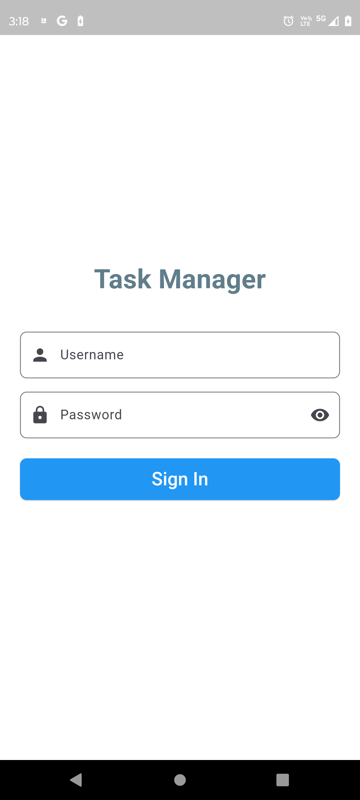
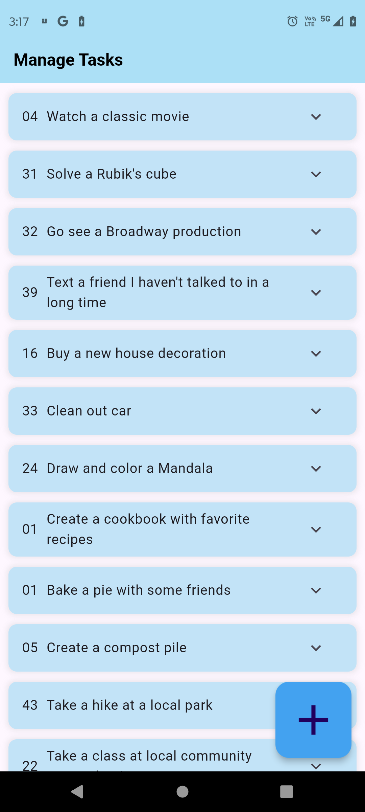
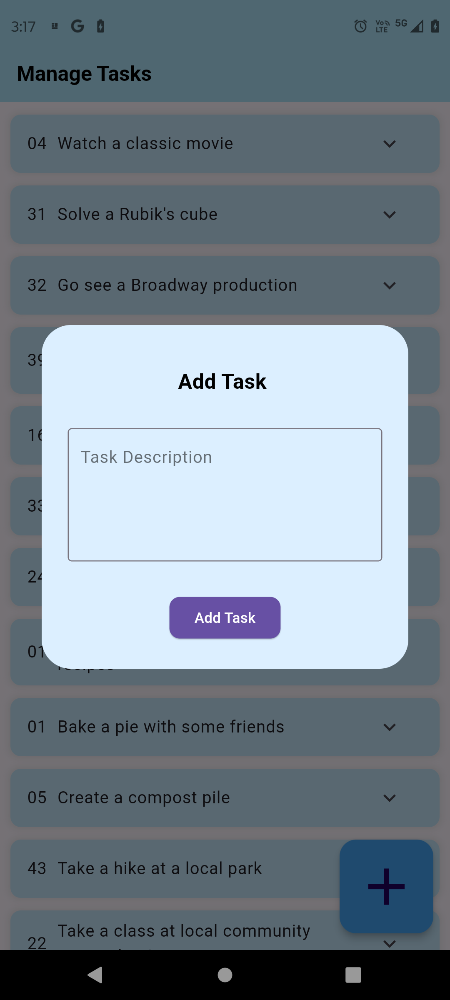
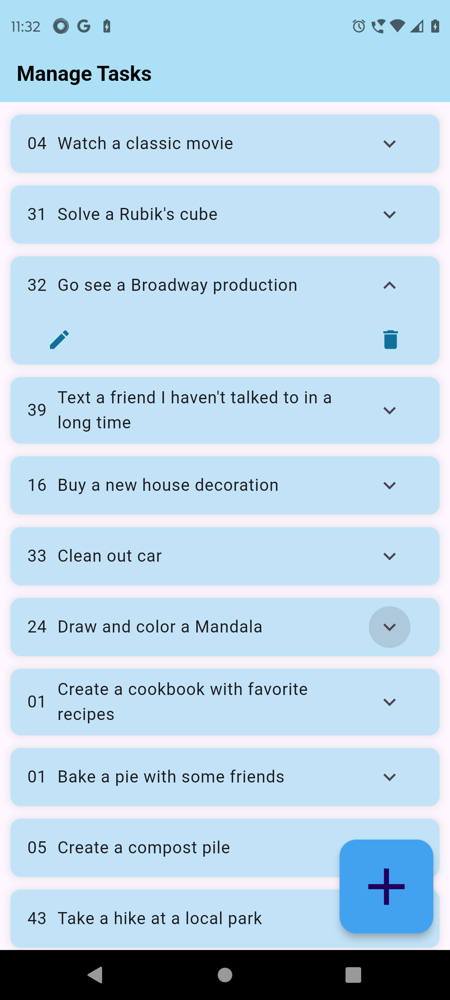
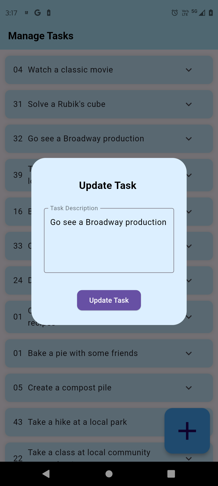

# Task Manager App

This Flutter project is a task manager app that allows users to manage their tasks efficiently. The app provides features such as user authentication, task management, pagination, state management, local storage, and unit tests.

## Overview

The Task Manager App is built using Flutter, a cross-platform framework for building mobile applications. It utilizes various Flutter packages and follows best practices to ensure a clean and intuitive user interface, robust state management, seamless performance, and proper data persistence.

### Instructions to run:

#### 1. Clone the Repository:

```
git clone <repository_url>
```

#### 2. Run the App:

Navigate into the project directory and run the following command:

```
flutter run
```

#### 3. Sign In:

Upon launching the app, you will be prompted to enter your username and password to access the application.

#### 4. Explore and Interact:

- **Expand Tiles:** Each item in the list is a tile. Expand each tile to perform actions.

- **Delete and Update Data:** Tap on a tile to reveal options for deleting or updating the data associated with it.

#### 5. Create New Tasks:

To add a new task, tap on the floating action button (FAB) located at the bottom right corner of the screen. It has a plus sign icon. Fill in the required information to create a new tile containing the task.

### Note:

- **Performance:** If your device isn't experiencing any performance issues, you should have a smooth experience using the app. The application is optimized for efficient performance, in case any lag or issue is seen just rerun the app.


## Key Features

### 1. User Authentication

The app implements user authentication using the provided [DummyJSON Auth Endpoint](https://dummyjson.com/docs/auth). Users can securely login with their username and password.

### 2. Task Management

Users can perform CRUD operations on tasks, including viewing, adding, editing, and deleting tasks. Task data is managed using the [DummyJSON Todos Endpoint](https://dummyjson.com/docs/todos).

### 3. Pagination

Pagination is implemented to efficiently fetch a large number of tasks. The app utilizes the [DummyJSON Pagination Endpoint](https://dummyjson.com/todos?limit=10&skip=10) for pagination.

### 4. State Management

State management is implemented using the Bloc Architecture. The app efficiently manages state updates across different screens and components, adhering to Flutter best practices and coding standards.

### 5. Local Storage

Tasks are persisted locally using Flutter's shared preferences. This ensures that tasks remain accessible even when the app is closed and reopened, with proper handling of local storage for data persistence.

### 6. Unit Tests

Unit testing in my application meticulously verifies the seamless authentication process, ensuring a flawless user experience and bolstering overall security measures. Quality and coverage are ensured through comprehensive testing, adhering to best practices for unit testing.

# ScreenShots










